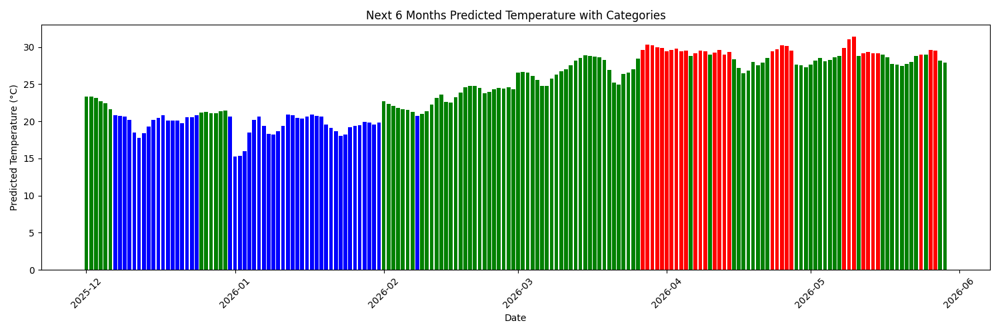

# ML Temperature Prediction Project

## Project Overview
This is an **end-to-end machine learning project** to predict daily temperatures in Dhaka using **real historical data** (2023–2025). Multiple ML models are evaluated, and the **best model is selected** for accurate future predictions.

## Dataset
- **Location:** Dhaka, Bangladesh  
- **Time Range:** January 2023 – November 2025  
- **Columns:**  
  - Date → Date of observation  
  - Temperature → Temperature in °C  

## Features Used
- Year (Year)  
- Month (Month)  
- Day (Day)  
- Weekday (Weekday)  

## Machine Learning Models
### Regression Models
- Linear Regression  
- Random Forest Regressor  
- KNN Regressor  

### Classification Models
- Logistic Regression  
- K-Nearest Neighbors (KNN)  
- Decision Tree  
- Random Forest  
- Naive Bayes  

**Model selection:**  
- Regression → RMSE metric  
- Classification → Accuracy metric  

## Future Prediction
- Predicts daily temperature for the **next 6 months**  
- Categorizes temperatures as:  
  - Cold (≤21°C)  
  - Normal (22–29°C)  
  - Hot (≥30°C)  
## Visualization
Bar chart showing predicted temperatures for next 6 months:

- Blue → Cold  
- Green → Normal  
- Red → Hot

## How to Run
```bash
# Install dependencies
pip install -r requirements.txt
# Run the project
python temp.py


## Author
Sijan Ahmed Reduan
